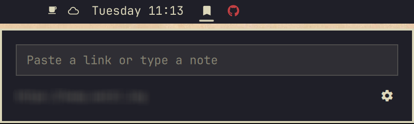

# Karakeep Quick Add

An [Omarchy](https://omarchy.org) bar-widget plugin that quickly saves a link
or a note to [Karakeep](https://karakeep.app): click the icon or configure a keyboard
shortcut, paste a URL or type a note, and press Enter.



## Install

```
omarchy plugin add https://github.com/embiem/omarchy-karakeep-plugin --enable
```

Or clone it manually into `~/.config/omarchy/plugins/embiem.karakeep/` and
enable it from the Omarchy settings menu.

## Setup

1. Click the Karakeep icon in the bar.
2. Enter your Karakeep server address (defaults to the managed
   `cloud.karakeep.app` — point it at your self-hosted instance instead if
   you run one).
3. Create an API key in Karakeep under **Settings > API Keys** with the
   `users:read` and `bookmarks:readwrite` scopes, and paste it in.
4. Add a shortcut of your choice to `~/.config/hypr/bindings.lua`:

   ```lua
   o.bind("SUPER + ALT + B", "Karakeep quick add", hl.dsp.global("embiem.karakeep:toggle"))
   ```

   Change `SUPER + ALT + K` to any unused combination. Saving the file applies
   the binding immediately.

The key is stored in your system keyring via `secret-tool` (part of
`libsecret`), never on disk in plaintext and never in Omarchy's own settings
file. Self-hosted servers must serve HTTPS — the plugin refuses to send an
API key over plaintext HTTP to anything but `localhost`/loopback.

## Use

- Press your configured shortcut or **left click** the bar icon to open the
  panel.
- Paste a URL to save it as a link, or type free text to save it as a note.
  Press Enter to submit.
- **Right click** the bar icon to jump straight to your Karakeep dashboard.
- Use **Change server or API key** in the panel to rotate the connection, or
  **Forget locally** to remove the stored key from your keyring (this does
  not revoke the key in Karakeep — do that from Karakeep's own settings).

## Uninstall

```
omarchy plugin remove embiem.karakeep
```

This removes the plugin's files only. If you connected it, also click
**Forget locally** in the panel first (or run `secret-tool clear plugin
embiem.karakeep` yourself) to remove the API key from your keyring.

## Development

The bulk of the logic — input classification, response parsing, and the
`karakeep-api` helper's HTTP/keyring handling — is plain Python and
Qt-free JavaScript so it can be tested without a running shell:

```
tests/karakeep-test.sh
```

The suite uses fakes for `secret-tool` and the Karakeep API; it never touches
your real keyring or a real server.

## License

[MIT](LICENSE)
